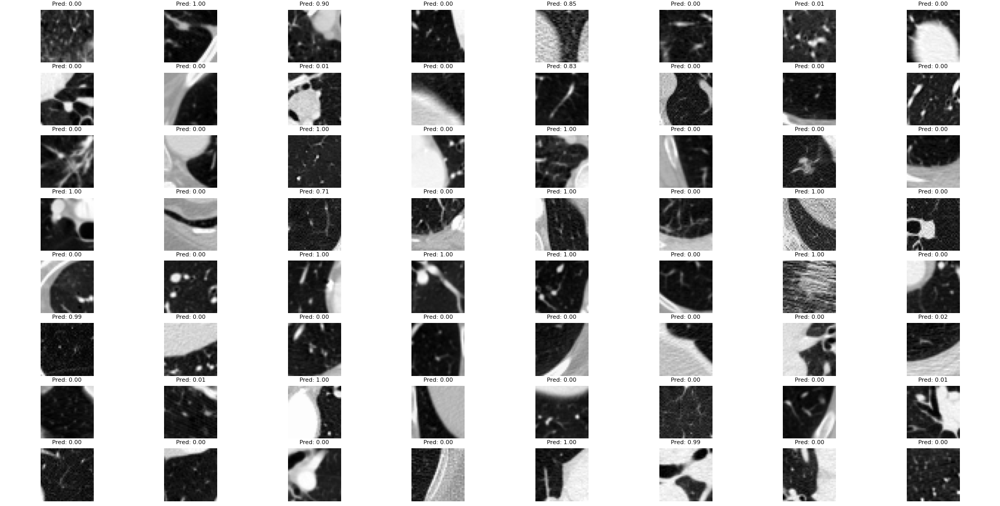

# LungNoduleFPRemoval

---


肺结节假阳性剔除模型

本次项目旨在完成肺结节假阳性的剔除，根本上属于三维图像的分类任务

- 数据集

使用的是lun16数据集，是一个用于肺结节检测和分析的医学影像数据集。它包含来自CT扫描的肺部影像，旨在帮助研究人员和开发者在肺结节识别、分类和分割等领域进行深度学习模型的训练和测试。数据集中提供了多种标注，包括结节的位置、大小和类型，便于进行细致的分析与研究。
```
分享下载链接：https://blog.csdn.net/weixin_48335963/article/details/120214931
```

- 下载环境
```
pip install -r requirements.txt
```

- 数据集位置
下载数据集合后存储在当前目录下的data路径下
```
data
```

- 数据预处理

```
python getMat.py
python classfier/moveMat.py
```

- 模型训练

```
python classfier/classfierMat.py
```


- 模型测试

```
python classfier/modelTest.py
```


| 指标                      | 值          |
| ------------------------- | ----------- |
| Area under the curve      | 0.990087069 |
| Accuracy                  | 0.964726631 |
| Sensitivity               | 0.945762712 |
| Specificity               | 0.971394517 |
| Positive predictive value | 0.920792079 |
| Negative predictive value | 0.980746089 |
| Positive likelihood ratio | 33.06228814 |
| Negative likelihood ratio | 0.05583446  |

- qt页面

```
python run ./Classification/qt/checkQt.py
```

 ps:若出现找不到文件，可以查看`.gitignore`由于`github`限制文件传输大小，我屏蔽了部分数据集、模型内容，现在保留的内容只有预处理过的数据，模型需要自己跑